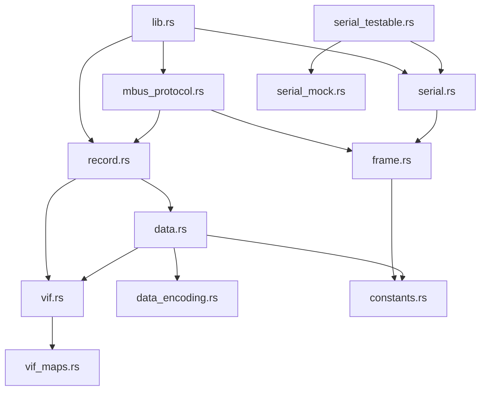

# Module Documentation

## Table of Contents
- [Core Modules](#core-modules)
- [M-Bus Protocol Modules](#m-bus-protocol-modules)
- [Payload Processing Modules](#payload-processing-modules)
- [Utility Modules](#utility-modules)
- [Testing Modules](#testing-modules)
- [Stub Modules](#stub-modules)

## Core Modules

### `lib.rs` - Public API
**Purpose**: Main library entry point providing high-level API functions.

**Key Exports**:
```rust
// Types
pub use MBusFrame, MBusFrameType;
pub use MBusRecord, MBusRecordValue;
pub use MBusError;
pub use MBusDeviceHandle, MBusDeviceManager;

// Functions (many are stubs)
pub async fn connect(port: &str) -> Result<MBusDeviceHandle, MBusError>;
pub async fn disconnect() -> Result<(), MBusError>;
pub async fn send_request(address: u8) -> Result<Vec<MBusRecord>, MBusError>;
pub async fn scan_devices() -> Result<Vec<String>, MBusError>;
```

**Dependencies**: All major modules

---

### `main.rs` - CLI Application
**Purpose**: Command-line interface for M-Bus operations.

**Features**:
- Interactive device communication
- Frame debugging
- Device scanning
- Data export

**Command Structure**:
```bash
mbus-rs [OPTIONS] <COMMAND>
Commands:
  scan     Scan for devices
  read     Read from device
  debug    Debug frame parsing
```

---

### `constants.rs` - Protocol Constants
**Purpose**: Central definition of M-Bus protocol constants.

**Key Constants**:
```rust
// Frame delimiters
pub const MBUS_FRAME_ACK: u8 = 0xE5;
pub const MBUS_FRAME_SHORT_START: u8 = 0x10;
pub const MBUS_FRAME_LONG_START: u8 = 0x68;
pub const MBUS_FRAME_STOP: u8 = 0x16;

// Control masks
pub const MBUS_CONTROL_MASK_SND_NKE: u8 = 0x40;
pub const MBUS_CONTROL_MASK_SND_UD: u8 = 0x53;
pub const MBUS_CONTROL_MASK_FCB: u8 = 0x20;

// DIB/DIF constants
pub const MBUS_DIB_DIF_EXTENSION_BIT: u8 = 0x80;
pub const MBUS_DIB_VIF_EXTENSION_BIT: u8 = 0x80;
pub const MBUS_DATA_RECORD_DIF_MASK_DATA: u8 = 0x0F;
```

---

### `error.rs` - Error Types
**Purpose**: Comprehensive error handling for the crate.

**Error Enum**:
```rust
#[derive(Debug, thiserror::Error)]
pub enum MBusError {
    #[error("Serial port error: {0}")]
    SerialPortError(String),

    #[error("Frame parse error: {0}")]
    FrameParseError(String),

    #[error("Invalid checksum: expected {expected:02X}, calculated {calculated:02X}")]
    InvalidChecksum { expected: u8, calculated: u8 },

    #[error("Unknown VIF: {0:02X}")]
    UnknownVif(u8),

    #[error("Unknown DIF: {0:02X}")]
    UnknownDif(u8),

    #[error("Premature end at data")]
    PrematureEndAtData,

    #[error("Invalid manufacturer")]
    InvalidManufacturer,

    // Additional variants...
}
```

## M-Bus Protocol Modules

### `mbus/frame.rs` - Frame Processing
**Purpose**: Parse and pack M-Bus frames using nom parser combinators.

**Key Functions**:
```rust
// Parse bytes into frame structure
pub fn parse_frame(input: &[u8]) -> IResult<&[u8], MBusFrame>

// Serialize frame to bytes
pub fn pack_frame(frame: &MBusFrame) -> Vec<u8>

// Validate frame checksum
pub fn verify_frame(frame: &MBusFrame) -> Result<(), MBusError>

// Pack secondary addressing frame
pub fn pack_select_frame(frame: &mut MBusFrame, mask: &str) -> Result<(), MBusError>
```

**Frame Structure**:
```rust
pub struct MBusFrame {
    pub frame_type: MBusFrameType,
    pub control: u8,
    pub address: u8,
    pub control_information: u8,
    pub data: Vec<u8>,
    pub checksum: u8,
    pub more_records_follow: bool,
}

pub enum MBusFrameType {
    Ack,
    Short,
    Control,
    Long,
}
```

---

### `mbus/mbus_protocol.rs` - Protocol Logic
**Purpose**: High-level protocol operations and device communication.

**Key Components**:

#### DataRetrievalManager
```rust
pub struct DataRetrievalManager {
    fcb: bool,  // Frame count bit
    scanner: PrimaryAddressScanner,
    requestor: DataRequestor,
    parser: ResponseParser,
}

impl DataRetrievalManager {
    pub async fn request_data(&mut self, handle: &mut MBusDeviceHandle, address: u8)
        -> Result<Vec<MBusRecord>, MBusError>

    pub async fn scan_primary_addresses(&mut self, handle: &mut MBusDeviceHandle)
        -> Result<Vec<u8>, MBusError>
}
```

#### DataRequestor
```rust
impl DataRequestor {
    pub fn create_request_frame(&mut self, address: u8) -> MBusFrame
    pub fn create_select_frame(&self, secondary_address: &str) -> MBusFrame
}
```

#### ResponseParser
```rust
impl ResponseParser {
    pub fn parse_response(&self, frame: &MBusFrame) -> Result<Vec<MBusRecord>, MBusError>
    pub fn handle_multi_telegram(&mut self, frames: Vec<MBusFrame>) -> Vec<MBusRecord>
}
```

---

### `mbus/serial.rs` - Serial Communication
**Purpose**: Async serial port communication for M-Bus devices.

**Key Structure**:
```rust
pub struct MBusDeviceHandle {
    port: tokio_serial::SerialStream,
    config: SerialConfig,
}

pub struct SerialConfig {
    pub baudrate: u32,      // 300-38400
    pub timeout: Duration,
}

impl MBusDeviceHandle {
    pub async fn connect(port_name: &str) -> Result<MBusDeviceHandle, MBusError>
    pub async fn send_frame(&mut self, frame: &MBusFrame) -> Result<(), MBusError>
    pub async fn recv_frame(&mut self) -> Result<MBusFrame, MBusError>
}
```

**Timeout Mapping**:
- 300 baud → 1300ms
- 600 baud → 800ms
- 1200 baud → 500ms
- 2400 baud → 300ms
- 9600+ baud → 200ms

## Payload Processing Modules

### `payload/record.rs` - Record Parsing
**Purpose**: Parse M-Bus data records from frames.

**Key Functions**:
```rust
// Parse fixed-length record (16 bytes)
pub fn parse_fixed_record(input: &[u8]) -> Result<MBusRecord, MBusError>

// Parse variable-length record
pub fn parse_variable_record(input: &[u8]) -> Result<MBusRecord, MBusError>

// DIB/VIB processing
fn parse_variable_record_inner(input: &[u8]) -> IResult<&[u8], MBusRecord>
```

**Record Structure**:
```rust
pub struct MBusRecord {
    pub timestamp: SystemTime,
    pub storage_number: u32,
    pub tariff: i32,
    pub device: i32,
    pub is_numeric: bool,
    pub value: MBusRecordValue,
    pub unit: String,
    pub function_medium: String,
    pub quantity: String,
    pub drh: MBusDataRecordHeader,
    pub data_len: usize,
    pub data: [u8; 256],
}

pub struct MBusDataRecordHeader {
    pub dib: MBusDataInformationBlock,
    pub vib: MBusValueInformationBlock,
}
```

---

### `payload/data.rs` - Data Decoding
**Purpose**: Decode M-Bus data values from raw bytes.

**Key Function**:
```rust
pub fn mbus_data_record_decode(
    record: &MBusRecord
) -> Result<(String, MBusRecordValue, String), MBusError>
```

**Supported Data Types**:
- No data (0x00)
- Integer (8/16/24/32/48/64-bit)
- BCD (2/4/6/8/12 digits)
- Float (32-bit IEEE 754)
- String (ASCII)
- Date/Time (Type F/G/I)

---

### `payload/data_encoding.rs` - Type Encoding
**Purpose**: Encode and decode various data types used in M-Bus.

**Key Functions**:
```rust
// BCD encoding
pub fn decode_bcd(input: &[u8]) -> IResult<&[u8], u32>
pub fn encode_bcd(input: u32) -> Vec<u8>

// Integer encoding
pub fn decode_int(input: &[u8], size: usize) -> IResult<&[u8], i32>
pub fn encode_int_u64(value: u64, output: &mut [u8]) -> Result<(), MBusIntEncodeError>

// Float encoding
pub fn decode_float(input: &[u8]) -> IResult<&[u8], f32>

// Time encoding
pub fn decode_mbus_time(input: &[u8]) -> Result<SystemTime, MBusTimeDecodeError>

// Manufacturer codes
pub fn mbus_decode_manufacturer(byte1: u8, byte2: u8) -> String
pub fn mbus_data_manufacturer_encode(manufacturer: &str) -> Result<[u8; 2], MBusError>
```

---

### `payload/vif.rs` - VIF Processing
**Purpose**: Process Value Information Fields to determine units and scaling.

**Key Functions**:
```rust
pub fn normalize_vib(vib: &MBusValueInformationBlock) -> (String, f64, String)
pub fn parse_vif(vif: u8) -> Result<VifInfo, MBusError>
```

**VIF Categories**:
- Energy (Wh, J)
- Volume (m³, L)
- Mass (kg, t)
- Power (W, J/h)
- Flow (m³/h, kg/h)
- Temperature (°C, K)
- Time (seconds, days)
- Dimensionless

---

### `payload/vif_maps.rs` - VIF Lookup Tables
**Purpose**: Mapping tables for VIF codes to units and quantities.

**Structure**:
```rust
pub const VIF_TABLE: &[(u8, &str, f64, &str)] = &[
    (0x00, "Wh", 1e-3, "Energy"),
    (0x01, "10^-1 Wh", 1e-4, "Energy"),
    // ... extensive lookup table
];
```

## Utility Modules

### `logging.rs` - Logging Support
**Purpose**: Application logging configuration.

**Functions**:
```rust
pub fn init_logger()
pub fn log_info(message: &str)
pub fn log_error(message: &str)
pub fn log_debug(message: &str)
```

**Configuration**: Uses `RUST_LOG` environment variable.

---

### `mbus_device_manager.rs` - Device Management
**Purpose**: High-level device management (currently stub).

**Planned Features**:
```rust
pub struct MBusDeviceManager {
    devices: HashMap<u8, DeviceInfo>,
    connections: Vec<MBusDeviceHandle>,
}

impl MBusDeviceManager {
    pub async fn add_device(&mut self, port: &str) -> Result<u8, MBusError>
    pub async fn remove_device(&mut self, id: u8) -> Result<(), MBusError>
    pub async fn read_all(&mut self) -> Result<Vec<MBusRecord>, MBusError>
}
```

## Testing Modules

### `mbus/serial_mock.rs` - Mock Serial Port
**Purpose**: In-memory serial port simulation for testing.

**Features**:
```rust
pub struct MockSerialPort {
    pub tx_buffer: Arc<Mutex<Vec<u8>>>,     // Outgoing data
    pub rx_buffer: Arc<Mutex<VecDeque<u8>>>, // Incoming data
    pub next_error: Arc<Mutex<Option<io::Error>>>,
}

impl MockSerialPort {
    pub fn queue_rx_data(&self, data: &[u8])
    pub fn get_tx_data(&self) -> Vec<u8>
    pub fn queue_frame_response(&self, frame_type: FrameType, data: Option<Vec<u8>>)
    pub fn set_next_error(&self, error: io::Error)
}
```

---

### `mbus/serial_testable.rs` - Testable Serial Interface
**Purpose**: Dependency injection for serial port testing.

**Trait Definition**:
```rust
#[async_trait]
pub trait SerialPort: AsyncReadExt + AsyncWriteExt + Unpin + Send {
    async fn flush(&mut self) -> Result<(), std::io::Error>;
}

pub struct TestableDeviceHandle<P: SerialPort> {
    port: P,
    baudrate: u32,
    timeout: Duration,
}
```

## Stub Modules

### Wireless M-Bus (`wmbus/`)
**Status**: Placeholder for future implementation.

**Planned Modules**:
- `wmbus/encryption.rs` - AES-128 encryption
- `wmbus/frame.rs` - Wireless frame formats
- `wmbus/handle.rs` - Device handle
- `wmbus/network.rs` - Network management
- `wmbus/protocol.rs` - Wireless protocol


## Module Dependencies



## Module Statistics

| Module           | Lines | Functions | Coverage |
|------------------|-------|-----------|----------|
| frame.rs         | 207   | 12        | 97.58%   |
| mbus_protocol.rs | 207   | 41        | 74.88%   |
| serial.rs        | 111   | 31        | 18.92%   |
| record.rs        | 318   | 16        | 93.71%   |
| data.rs          | 110   | 11        | 93.64%   |
| data_encoding.rs | 224   | 23        | 79.91%   |
| vif.rs           | 133   | 17        | 94.74%   |
| vif_maps.rs      | 27    | 9         | 77.78%   |

## Module Guidelines

### Adding New Modules
1. Place in appropriate directory (mbus/, payload/, etc.)
2. Add module declaration to parent mod.rs
3. Document public API with rustdoc
4. Include unit tests in module
5. Update this documentation

### Module Best Practices
- Keep modules focused on single responsibility
- Use `pub(crate)` for internal APIs
- Prefer composition over inheritance
- Write tests alongside implementation
- Document invariants and assumptions
